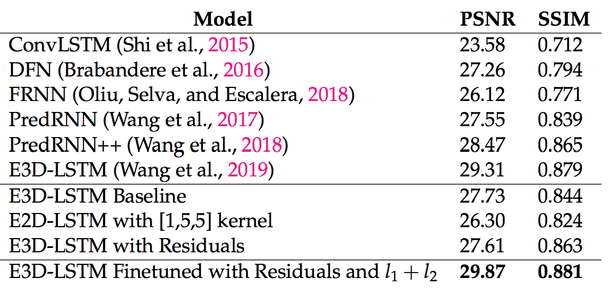
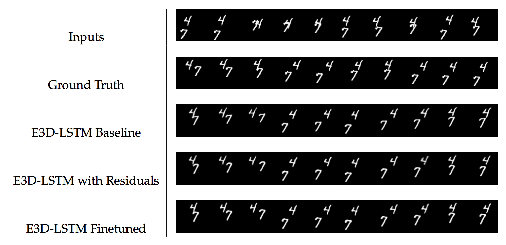
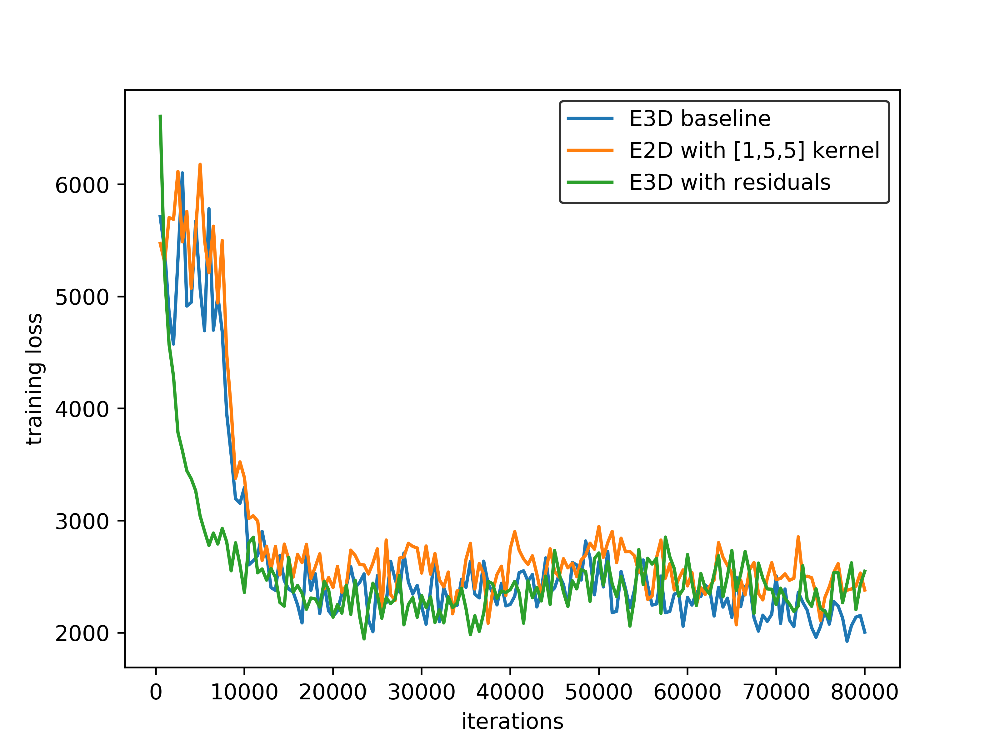

# Mental Simulation with Self-Supervised Spatiotemporal Learning

This repo contains a TensorFlow implementation of [**Mental Simulation with Self-Supervised Spatiotemporal Learning**]().

*Author*: Kevin Tan 

*Commitee*: Dr. Zhuowen Tu, Dr. Virginia de Sa, Kwonjoon Lee

**Abstract**: Mental simulation -- the capacity to imagine objects and scenes in order to make decisions, predictions, and inferences about the world -- is a key feature of human cognition. Evidence from behavioral studies suggest that representations of visual imagery are spatial and sensitive to the causal structure of the world. Inspired by how humans anticipate future scenes, we aim to leverage state-of-the-art techniques in deep learning and computer vision to tackle the problem of spatiotemporal predictive learning in a self-supervised manner. We perform explorations across three architectural design choices: (i) the importance of 2D-convolution vs. 3D-convolution inside the cell of recurrent neural networks, (ii) the effectiveness of residual connections in stacked long short-term memory models for remembering spatial information over long time horizons, and (iii) the balance between $l_1$ norm and $l_2$ norm components in the objective function. Our extensive evaluations demonstrate that finetuning with residual connections achieves state-of-the-art performance on the Moving MNIST and KTH Action benchmark datasets. Potential application areas include weather forecasting, traffic flow prediction, and physical interaction simulation. 






## Setup

All code was developed and tested on Nvidia V100 the following environment.

- Python 2.7
- opencv3
- scikit-image
- numpy
- tensorflow >=1.9.0
- cuda>=8.0
- cudnn>=5.0
- 4 NVIDIA Titan X (Pascal) 12GB 

Please download the data via the following external links.

* [Moving MNIST](https://www.dropbox.com/s/fpe24s1t94m87rn/moving-mnist-example.tar.gz?dl=0) is a dataset with two moving digits bouncing in a 64 by 64 area.
* [KTH Actions](https://www.dropbox.com/s/ppmob712dzgogly/kth_action.tar.gz?dl=0) is a human action dataset. This dataset contains frames from original videos. It selects the reasonable, predictable ones and resize them.


## Quick Start

To train our model on the Moving NIST dataset using:

```
python -u run.py \
    --is_training True \
    --dataset_name mnist \
    --train_data_paths ~/data/moving-mnist-example/moving-mnist-train.npz \
    --valid_data_paths ~/data/moving-mnist-example/moving-mnist-valid.npz \
    --pretrained_model pretrain_model/moving_mnist_e3d_lstm/model.ckpt-80000 \
    --save_dir checkpoints/_mnist_e3d_lstm \
    --gen_frm_dir results/_mnist_e3d_lstm \
    --model_name e3d_lstm \
    --allow_gpu_growth True \
    --img_channel 1 \
    --img_width 64 \
    --input_length 10 \
    --total_length 20 \
    --filter_size 5 \
    --num_hidden 64,64,64,64 \
    --patch_size 4 \
    --layer_norm True \
    --sampling_stop_iter 50000 \
    --sampling_start_value 1.0 \
    --sampling_delta_per_iter 0.00002 \
    --lr 0.001 \
    --batch_size 4 \
    --max_iterations 1 \
    --display_interval 1 \
    --test_interval 1 \
    --snapshot_interval 10000
```

A full list of commands can be found in the script folder.
The training script has a number of command-line flags that you can use to configure the model architecture, hyperparameters, and input / output settings.
Below are the parameters about our model:

- `--model_name`: The model name. Default value is `e3d_lstm`.
- `--pretrained_model`: Directory to find our pretrained models. See below for the download instruction.
- `--num_hidden`: Comma separated number of units of e3d lstms
- `--filter_size`: Filter of a single e3d-lstm layer.
- `--layer_norm`: Whether to apply tensor layer norm.

`scheduled_sampling`, `sampling_stop_iter`, `sampling_start_value` and `sampling_changing_rate` are hyperparameters used for scheduled sampling in training. The standard parameters for training and testing are:

- `--is_training`: Is it training or testing.
- `--train_data_paths`, `--valid_data_paths`: Training and validation dataset path.
- `--gen_frm_dir`: Directory to store the prediction results.
- `--allow_gpu_growth`: Whether allows GPU to grow.
- `--input_length 10`: Input sequence length.
- `--total_length 20`: Input and output sequence length in total.

To test a model, set `--is_training False`.

## Pretrained Models

First download the pretrained models. You can test it on the dataset:

* [Moving MNIST](https://storage.googleapis.com/e3d_lstm/pretrained_models/kth_e3d_lstm_pretrain.zip)
* [KTH Actions](https://storage.googleapis.com/e3d_lstm/pretrained_models/moving_mnist_e3d_lstm_pretrain.zip)

## Acknowledgments
This code is based on the TensorFlow implementation of the paper [**Eidetic 3D LSTM: A Model for Video Prediction and Beyond**](https://openreview.net/forum?id=B1lKS2AqtX), ICLR 2019. 

